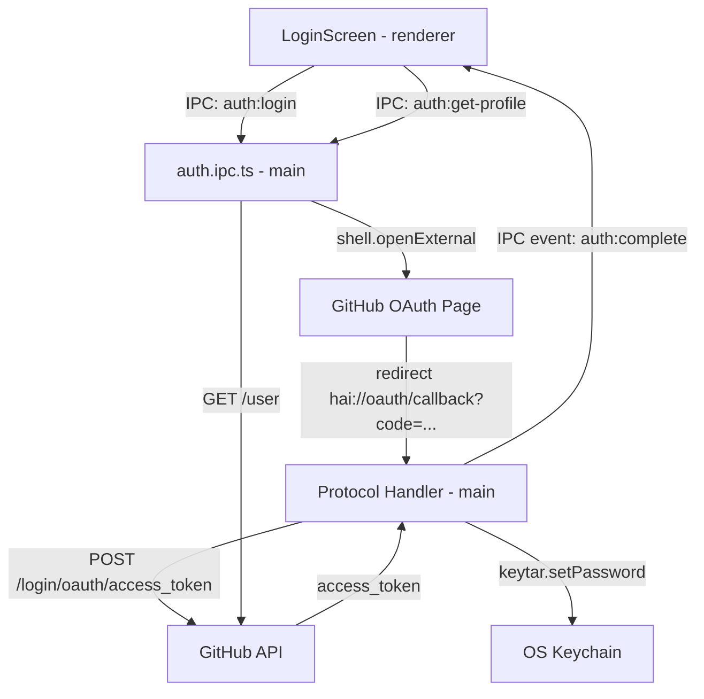

# Auth OAuth Design

**Spec**: `.specs/features/auth-oauth/spec.md`
**Status**: Draft

---

## Architecture Overview

OAuth em Electron usa fluxo com protocol handler customizado: browser externo autoriza, GitHub redireciona para `hai://oauth/callback?code=...`, Electron intercepta via `app.setAsDefaultProtocolClient`, e o main process troca o `code` pelo `access_token`.



---

## Components

### `LoginScreen.tsx`
- **Purpose**: Tela inicial exibida quando não autenticado
- **Location**: `src/screens/LoginScreen.tsx`
- **Interfaces**:
  - Botão "Entrar com GitHub" → chama `authService.login()`
  - Loading state durante o fluxo OAuth
  - Erro inline se auth falhar
- **Dependencies**: `authService`, `authStore`

### `UserProfile.tsx`
- **Purpose**: Avatar + nome do usuário na parte inferior da sidebar
- **Location**: `src/components/auth/UserProfile.tsx`
- **Interfaces**:
  - Lê `authStore.profile` (login, name, avatar_url)
  - Click → abre `<SettingsModal>`
- **Dependencies**: `authStore`

### `SettingsModal.tsx`
- **Purpose**: Modal de configurações (Cmd+,)
- **Location**: `src/components/settings/SettingsModal.tsx`
- **Interfaces**:
  - Seção Perfil: avatar, nome, botão "Sair"
  - Seção Editor: fonte, tamanho, vim mode
  - Seção Sync: intervalo, repo configurado, modo local/sync
  - Seção Aparência: tema (auto/light/dark)
- **Dependencies**: `authStore`, `authService`, `settingsStore`

### `authService` (renderer)
- **Purpose**: Wrapper IPC para operações de auth
- **Location**: `src/services/auth.ts`
- **Interfaces**:
  ```typescript
  login(): Promise<void>
  logout(): Promise<void>
  getProfile(): Promise<GitHubProfile>
  getToken(): Promise<string | null>
  ```
- **Dependencies**: `window.electronAPI.auth`, `authStore`

### `auth.ipc.ts` (main process)
- **Purpose**: Handlers OAuth + keychain + GitHub API
- **Location**: `electron/ipc/auth.ipc.ts`
- **Interfaces**:
  ```typescript
  // auth:login
  //   → shell.openExternal(githubOAuthUrl)
  //   → aguarda protocol callback via protocol handler

  // auth:get-profile
  //   → keytar.getPassword('hai', 'github-token')
  //   → GET https://api.github.com/user
  //   → retorna GitHubProfile

  // auth:logout
  //   → keytar.deletePassword('hai', 'github-token')
  //   → emite evento para renderer

  // auth:get-token
  //   → keytar.getPassword('hai', 'github-token')
  //   → retorna string | null
  ```
- **Dependencies**: `keytar`, `electron.shell`, `electron.app`, `electron-store`

### `authStore`
- **Purpose**: Estado de autenticação global no renderer
- **Location**: `src/stores/auth.store.ts`
- **Interfaces**:
  ```typescript
  interface AuthStore {
    isAuthenticated: boolean
    profile: GitHubProfile | null
    isLoading: boolean
    error: string | null
    setProfile(p: GitHubProfile): void
    setLoading(v: boolean): void
    setError(e: string | null): void
    logout(): void
  }
  ```

---

## Data Models

```typescript
interface GitHubProfile {
  login: string
  name: string | null
  avatar_url: string
  email: string | null
}

interface AuthConfig {
  // Nada armazenado no electron-store — token fica APENAS no keychain
  // Profile em cache para evitar chamadas desnecessárias à API
  cachedProfile: GitHubProfile | null
  profileCachedAt: string | null
}
```

---

## OAuth Flow Detalhado

```typescript
// electron/main.ts — registrar protocol handler
app.setAsDefaultProtocolClient('hai')

app.on('open-url', (event, url) => {
  // url = hai://oauth/callback?code=xxx&state=yyy
  event.preventDefault()
  const parsed = new URL(url)
  const code = parsed.searchParams.get('code')
  handleOAuthCallback(code, mainWindow)
})

// auth.ipc.ts
async function handleOAuthCallback(code: string, win: BrowserWindow) {
  const response = await fetch('https://github.com/login/oauth/access_token', {
    method: 'POST',
    headers: { Accept: 'application/json', 'Content-Type': 'application/json' },
    body: JSON.stringify({ client_id: CLIENT_ID, client_secret: CLIENT_SECRET, code })
  })
  const { access_token } = await response.json()
  await keytar.setPassword('hai', 'github-token', access_token)
  win.webContents.send('auth:complete')
}
```

**Nota sobre client_secret:** armazenado no keychain na primeira configuração (build-time injection via env var segura), não hardcoded no código.

---

## IPC adicionado ao Preload

```typescript
auth: {
  login: () => ipcRenderer.invoke('auth:login'),
  logout: () => ipcRenderer.invoke('auth:logout'),
  getProfile: () => ipcRenderer.invoke('auth:get-profile'),
  getToken: () => ipcRenderer.invoke('auth:get-token'),
  onComplete: (cb) => ipcRenderer.on('auth:complete', cb),
},
```

---

## App Init Flow

```
App abre
  ↓
main.ts: registrar protocol handler (hai://)
  ↓
renderer: authService.getToken()
  ├─ token presente → authService.getProfile() → carregar app
  └─ sem token → exibir LoginScreen
```

---

## Error Handling

| Cenário | Tratamento |
|---|---|
| Usuário fecha browser sem autorizar | Timeout de 5min no login; LoginScreen retorna ao estado inicial |
| GitHub retorna erro (access_denied) | Mensagem inline na LoginScreen |
| Token revogado (401 em qualquer chamada) | Limpar keychain + redirecionar para LoginScreen |
| Keychain inacessível | Toast com instrução para reautenticar |

---

## Tech Decisions

| Decisão | Escolha | Motivo |
|---|---|---|
| OAuth flow | Protocol handler (`hai://`) | Padrão para Electron — sem servidor local para receber callback |
| Token storage | `keytar` (OS keychain) | Nunca em texto plano, consistente com padrão já usado no sync |
| Client secret | Env var no build | Não exposto no código-fonte; injetado pelo build pipeline |
| Profile cache | `electron-store` | Evita chamada à API no startup, refresh ao abrir app |
