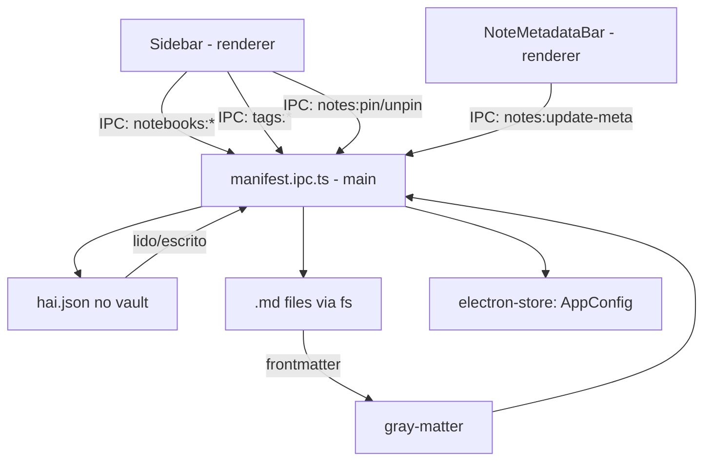

# Data Model Design

**Spec**: `.specs/features/data-model/spec.md`
**Status**: Draft

---

## Architecture Overview

O `hai.json` é a fonte de verdade para organização. Ele vive na raiz do vault, é gerenciado exclusivamente pelo app (nunca editado manualmente pelo usuário), e é versionado junto com as notas no GitHub sync.



---

## Components

### `NotebookSection.tsx`
- **Purpose**: Lista de notebooks na sidebar com drag-to-reorder
- **Location**: `src/components/sidebar/NotebookSection.tsx`
- **Interfaces**:
  - Lê `manifestStore.notebooks`
  - Click em notebook → filtra file tree para aquela pasta
  - Right-click → menu: Renomear, Mudar cor, Deletar
  - Botão "+" → cria novo notebook (inline input)
- **Dependencies**: `manifestStore`, `manifestService`

### `TagsPanel.tsx`
- **Purpose**: Lista de tags com cores, filtragem por tag
- **Location**: `src/components/sidebar/TagsPanel.tsx`
- **Interfaces**:
  - Lê `manifestStore.tags`
  - Click → filtra notas com aquela tag
  - Right-click → editar label/cor, deletar tag
- **Dependencies**: `manifestStore`, `manifestService`

### `NoteMetadataBar.tsx`
- **Purpose**: Barra abaixo do editor com tags e notebook da nota ativa
- **Location**: `src/components/editor/NoteMetadataBar.tsx`
- **Interfaces**:
  - Exibe tags da nota (lê frontmatter via `noteStore.currentNoteMeta`)
  - Dropdown para assignar notebook
  - Tag picker para adicionar/remover tags
  - Ao mudar: atualiza frontmatter + hai.json
- **Dependencies**: `manifestStore`, `noteStore`, `manifestService`

### `PinnedSection.tsx`
- **Purpose**: Seção "Fixadas" no topo da sidebar
- **Location**: `src/components/sidebar/PinnedSection.tsx`
- **Interfaces**:
  - Lê `manifestStore.pinned`
  - Exibe notas fixadas com nome + ícone de pin
  - Click → abre nota
- **Dependencies**: `manifestStore`

### `InboxSection.tsx`
- **Purpose**: Seção Inbox na sidebar com badge de contagem
- **Location**: `src/components/sidebar/InboxSection.tsx`
- **Interfaces**:
  - Lista notas na pasta inbox (sem notebook atribuído)
  - Badge com contagem de notas não organizadas
- **Dependencies**: `manifestStore`, `fileTreeStore`

### `manifestService` (renderer)
- **Purpose**: Wrapper IPC para operações no manifesto
- **Location**: `src/services/manifest.ts`
- **Interfaces**:
  ```typescript
  loadManifest(): Promise<HaiManifest>
  saveManifest(manifest: HaiManifest): Promise<void>
  createNotebook(name: string, color?: string): Promise<Notebook>
  renameNotebook(id: string, name: string): Promise<void>
  deleteNotebook(id: string, strategy: 'inbox' | 'delete'): Promise<void>
  reorderNotebooks(ids: string[]): Promise<void>
  createTag(name: string, label: string, color: string): Promise<Tag>
  updateTag(name: string, updates: Partial<Tag>): Promise<void>
  deleteTag(name: string): Promise<void>
  pinNote(path: string): Promise<void>
  unpinNote(path: string): Promise<void>
  updateNoteMeta(path: string, meta: Partial<NoteFrontmatter>): Promise<void>
  ```

### `manifest.ipc.ts` (main process)
- **Purpose**: Leitura/escrita do hai.json e operações de organização
- **Location**: `electron/ipc/manifest.ipc.ts`
- **Interfaces**:
  ```typescript
  // manifest:load → lê hai.json ou cria com defaults
  // manifest:save(manifest) → escreve hai.json

  // notebooks:create(name, color?) → cria pasta + entrada hai.json
  // notebooks:rename(id, name) → renomeia pasta no fs + hai.json
  // notebooks:delete(id, strategy) → move notas para inbox ou deleta
  // notebooks:reorder(ids[]) → atualiza order em hai.json

  // tags:create(name, label, color) → adiciona em hai.json
  // tags:update(name, updates) → atualiza tag
  // tags:delete(name) → remove tag + frontmatter das notas

  // notes:pin(path) → adiciona em hai.json.pinned
  // notes:unpin(path) → remove de hai.json.pinned
  // notes:update-meta(path, meta) → re-escreve frontmatter
  ```
- **Dependencies**: `gray-matter`, `fs/promises`, `path`, `electron-store`

### `manifestStore`
- **Purpose**: Estado do manifesto no renderer
- **Location**: `src/stores/manifest.store.ts`
- **Interfaces**:
  ```typescript
  interface ManifestStore {
    notebooks: Notebook[]
    tags: Tag[]
    pinned: string[]
    inbox: string
    isLoaded: boolean
    setManifest(m: HaiManifest): void
    addNotebook(n: Notebook): void
    removeNotebook(id: string): void
    updateNotebook(id: string, updates: Partial<Notebook>): void
    setTags(tags: Tag[]): void
    setPinned(paths: string[]): void
  }
  ```

---

## hai.json Defaults

```typescript
const DEFAULT_MANIFEST: HaiManifest = {
  version: 1,
  notebooks: [
    { id: uuid(), name: 'Inbox', path: 'inbox/', color: '#6b7280', icon: '📥', order: 0 }
  ],
  tags: [],
  pinned: [],
  inbox: 'inbox/',
}
```

---

## Note Frontmatter: Read/Write Flow

```typescript
// Ao abrir nota: manifest.ipc.ts usa gray-matter para ler frontmatter
import matter from 'gray-matter'

const { data: meta, content } = matter(rawFileContent)
// meta = { title, notebook, tags, created, updated, pinned }

// Ao atualizar metadata via NoteMetadataBar:
const updated = matter.stringify(content, { ...meta, ...updates, updated: new Date().toISOString() })
await fs.writeFile(notePath, updated, 'utf-8')
```

---

## Notebook → Pasta Mapping

```
vault/
├── hai.json
├── inbox/          ← notebooks[0].path = 'inbox/'
│   └── captura-rapida.md
├── projects/       ← notebooks[1].path = 'projects/'
│   └── hai-app.md
└── pessoal/        ← notebooks[2].path = 'pessoal/'
    └── ideias.md
```

O app **cria e gerencia as pastas**. O usuário não precisa entender a estrutura de diretórios — interage apenas com notebooks na UI.

---

## Tech Decisions

| Decisão | Escolha | Motivo |
|---|---|---|
| Frontmatter | `gray-matter` | Padrão de mercado, leve, lê/escreve YAML frontmatter |
| hai.json write | Debounce 300ms | Evita writes excessivos durante operações rápidas |
| Notebook = pasta | Mapeamento direto | Notas são `.md` acessíveis fora do app (portabilidade) |
| IDs de notebooks | UUID v4 | Evita colisões ao mesclar vaults em sync |
| Tag → frontmatter | Array de slugs | Tags fáceis de indexar, sem referências circulares |
