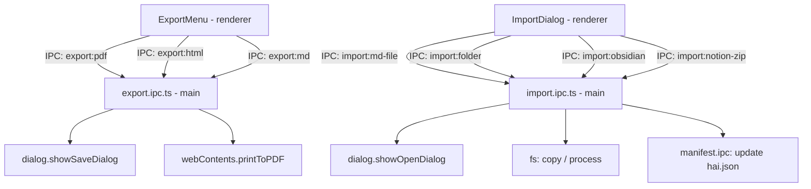

# Export & Import Design

**Spec**: `.specs/features/export-import/spec.md`
**Status**: Draft

---

## Architecture Overview

Export usa `webContents.printToPDF()` e renderização HTML no main process. Import usa `dialog.showOpenDialog` para seleção de arquivos e `fs` para cópia/processamento. Operações pesadas (Notion ZIP, Obsidian wikilinks) rodam no main process para não bloquear o renderer.



---

## Components

### `ExportMenu.tsx`
- **Purpose**: Menu/botão de export acessível pelo editor e menu Arquivo
- **Location**: `src/components/editor/ExportMenu.tsx`
- **Interfaces**:
  - Dropdown com opções: "Exportar PDF", "Exportar HTML", "Exportar .md puro"
  - Atalho `Cmd+Shift+E` abre dropdown
  - Cada opção dispara IPC correspondente com o path da nota ativa
- **Dependencies**: `exportService`, `noteStore`

### `ImportDialog.tsx`
- **Purpose**: Modal de seleção de fonte de import
- **Location**: `src/components/import/ImportDialog.tsx`
- **Interfaces**:
  - Quatro opções: "Arquivo .md", "Pasta de .md", "Obsidian vault", "Notion export (ZIP)"
  - Cada opção abre dialog nativo correspondente via IPC
  - Progress indicator para imports longos (Notion, Obsidian com muitos arquivos)
  - Resultado: relatório de arquivos importados / erros
- **Dependencies**: `importService`

### `GistShareButton.tsx`
- **Purpose**: Botão de compartilhar nota como GitHub Gist
- **Location**: `src/components/editor/GistShareButton.tsx`
- **Interfaces**:
  - Botão na toolbar do editor
  - Se nota já tem Gist (`frontmatter.gistUrl`): exibe URL + opção de atualizar
  - Caso contrário: cria novo Gist, copia URL, salva no frontmatter
- **Dependencies**: `exportService`, `noteStore`

### `exportService` (renderer)
- **Purpose**: Wrapper IPC para operações de export
- **Location**: `src/services/export.ts`
- **Interfaces**:
  ```typescript
  exportPDF(notePath: string): Promise<void>
  exportHTML(notePath: string, stripFrontmatter?: boolean): Promise<void>
  exportMD(notePath: string, stripFrontmatter?: boolean): Promise<void>
  shareAsGist(notePath: string): Promise<string>   // retorna URL
  updateGist(gistId: string, notePath: string): Promise<void>
  ```

### `importService` (renderer)
- **Purpose**: Wrapper IPC para operações de import com feedback de progresso
- **Location**: `src/services/import.ts`
- **Interfaces**:
  ```typescript
  importMDFile(): Promise<ImportResult>
  importFolder(): Promise<ImportResult>
  importObsidian(): Promise<ImportResult>
  importNotion(): Promise<ImportResult>
  ```

### `export.ipc.ts` (main process)
- **Purpose**: Handlers de export — PDF, HTML, .md, Gist
- **Location**: `electron/ipc/export.ipc.ts`
- **Interfaces**:
  ```typescript
  // export:pdf(notePath)
  //   → lê .md → renderiza HTML com marked/marked-highlight
  //   → BrowserWindow oculta carrega HTML → printToPDF()
  //   → dialog.showSaveDialog → fs.writeFile

  // export:html(notePath, stripFrontmatter?)
  //   → lê .md com gray-matter → renderiza HTML com CSS inline
  //   → dialog.showSaveDialog → fs.writeFile

  // export:md(notePath, stripFrontmatter?)
  //   → lê arquivo → remove frontmatter se solicitado
  //   → dialog.showSaveDialog → fs.writeFile

  // export:gist(notePath)
  //   → lê conteúdo → POST https://api.github.com/gists via Octokit
  //   → salva gistUrl no frontmatter
  //   → retorna URL
  ```
- **Dependencies**: `gray-matter`, `@octokit/rest`, `electron.dialog`, `electron.BrowserWindow`

### `import.ipc.ts` (main process)
- **Purpose**: Handlers de import — .md, pasta, Obsidian, Notion
- **Location**: `electron/ipc/import.ipc.ts`
- **Interfaces**:
  ```typescript
  // import:md-file
  //   → dialog.showOpenDialog({ filters: ['.md'] })
  //   → copia para notebook ativo (ou inbox)
  //   → resolve conflito de nome com sufixo

  // import:folder
  //   → dialog.showOpenDialog({ properties: ['openDirectory'] })
  //   → copia estrutura: subpastas → notebooks em hai.json
  //   → copia todos .md preservando hierarquia

  // import:obsidian
  //   → dialog.showOpenDialog → detecta .obsidian/ para validar vault
  //   → copia todos .md
  //   → converte [[wikilinks]] → [texto](path.md)
  //   → extrai tags de #hashtags inline → frontmatter

  // import:notion-zip
  //   → dialog.showOpenDialog({ filters: ['.zip'] })
  //   → extrai ZIP com adm-zip
  //   → processa estrutura de subpáginas
  //   → converte Database properties → frontmatter YAML
  ```
- **Dependencies**: `adm-zip`, `gray-matter`, `fs/promises`, `path`

---

## Data Models

```typescript
interface ImportResult {
  imported: number
  skipped: number
  errors: ImportError[]
  notebooks: string[]    // notebooks criados durante o import
}

interface ImportError {
  file: string
  reason: string
}
```

---

## Export: PDF Flow Detalhado

```typescript
// export.ipc.ts — handler 'export:pdf'
async function handleExportPDF(notePath: string, win: BrowserWindow) {
  const raw = await fs.readFile(notePath, 'utf-8')
  const { content } = matter(raw)
  const html = renderToHTML(content)   // marked com CSS embutido

  // BrowserWindow oculta para printToPDF
  const printWin = new BrowserWindow({ show: false, webPreferences: { offscreen: true } })
  await printWin.loadURL(`data:text/html,${encodeURIComponent(wrapInPrintHTML(html))}`)

  const pdfBuffer = await printWin.webContents.printToPDF({
    marginsType: 1,   // margens mínimas
    printBackground: true,
    pageSize: 'A4',
  })
  printWin.destroy()

  const { filePath } = await dialog.showSaveDialog(win, {
    defaultPath: path.basename(notePath, '.md') + '.pdf',
    filters: [{ name: 'PDF', extensions: ['pdf'] }]
  })
  if (filePath) await fs.writeFile(filePath, pdfBuffer)
}
```

---

## Import: Obsidian Wikilink Conversion

```typescript
// import.ipc.ts — conversão de wikilinks
function convertWikilinks(content: string, allNotePaths: string[]): string {
  // [[Nota]] → [Nota](nota.md)
  // [[Nota|Alias]] → [Alias](nota.md)
  return content.replace(/\[\[([^\]|]+)(?:\|([^\]]+))?\]\]/g, (_, target, alias) => {
    const slug = target.toLowerCase().replace(/\s+/g, '-')
    const display = alias ?? target
    return `[${display}](${slug}.md)`
  })
}

// Extrair #hashtags do corpo para frontmatter
function extractHashtags(content: string): { tags: string[], cleanContent: string } {
  const tags: string[] = []
  const clean = content.replace(/#([a-zA-Z][a-zA-Z0-9_-]*)/g, (_, tag) => {
    tags.push(tag.toLowerCase())
    return ''  // remove do corpo
  })
  return { tags: [...new Set(tags)], cleanContent: clean.trim() }
}
```

---

## Import: Notion ZIP Structure

Notion exporta ZIP com estrutura:
```
Export-XXXXXXXX/
├── Page Name XXXXXXXX.md
├── Page Name XXXXXXXX/
│   ├── Sub Page XXXXXXXX.md
│   └── ...
└── Database XXXXXXXX.csv   ← ignorado na V1
```

Processamento:
1. Extrair ZIP para diretório temporário
2. Mapear pastas para notebooks no hai.json
3. Processar cada `.md`: remover IDs Notion do nome, converter metadata
4. Ignorar `.csv` (databases) — V2

---

## CSS de Impressão (PDF/HTML)

```css
/* Embutido no HTML gerado */
body { font-family: Georgia, serif; max-width: 720px; margin: 0 auto; line-height: 1.7; color: #1a1a1a; }
h1, h2, h3 { margin-top: 2em; }
code { font-family: 'Courier New', monospace; background: #f5f5f5; padding: 2px 4px; border-radius: 3px; }
pre { background: #f5f5f5; padding: 1em; border-radius: 6px; overflow-x: auto; }
@media print { body { font-size: 11pt; } pre { page-break-inside: avoid; } }
```

---

## Tech Decisions

| Decisão | Escolha | Motivo |
|---|---|---|
| PDF generation | `webContents.printToPDF()` | Nativo do Electron, zero dependências extras |
| HTML rendering | `marked` (já disponível ou lightweight) | Leve, suficiente para export standalone |
| ZIP processing | `adm-zip` | Pure JS, sem binários nativos, funciona no main process |
| Wikilink conversion | Regex + replace | Suficiente para V1 — sem parser AST necessário |
| Notion IDs | Strip com regex `[A-Z0-9]{32}` | Notion adiciona hash no nome de cada arquivo |
| Gist share | `@octokit/rest` (já disponível do sync) | Reutiliza dep existente |
| Import destino default | `inbox/` do vault | Consistente com criação de notas sem notebook |
