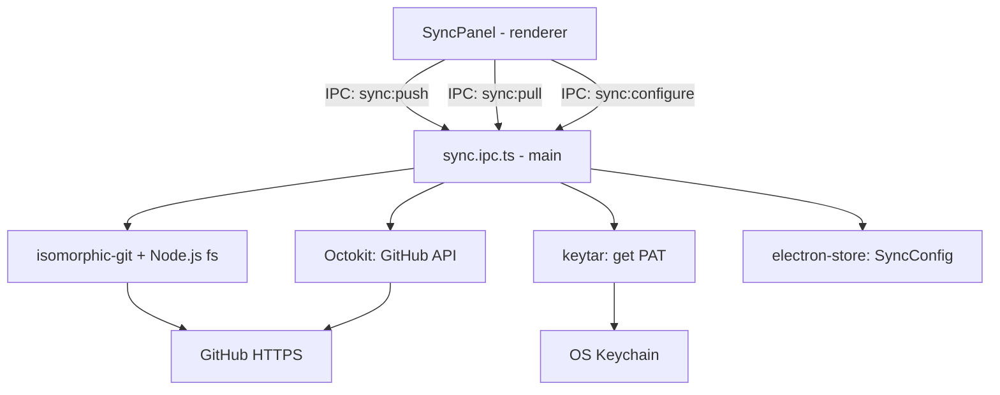

# GitHub Sync Design

**Spec**: `.specs/features/github-sync/spec.md`
**Status**: Draft

---

## Architecture Overview

Com Electron, isomorphic-git roda no **main process** com acesso direto ao Node.js `fs` — sem nenhum adaptador customizado. O PAT é armazenado no keychain do SO via `keytar`. O renderer se comunica via IPC.



**Principal simplificação vs Tauri:** isomorphic-git usa `fs/promises` do Node.js diretamente no main process. Nenhum adaptador necessário.

---

## Components

### `SyncStatusBadge.tsx`
- **Purpose**: Badge no header com estado do sync — sempre visível
- **Location**: `src/components/sync/SyncStatusBadge.tsx`
- **Interfaces**:
  - Lê `syncStore.status` e `syncStore.pendingChanges`
  - Estados visuais: `synced` (verde) | `pending` (amarelo + número) | `error` (vermelho) | `not-configured` (cinza) | `syncing` (spinner)
- **Dependencies**: `syncStore`

### `SyncPanel.tsx`
- **Purpose**: Painel de ações de sync (pode ser dropdown do badge ou sidebar section)
- **Location**: `src/components/sync/SyncPanel.tsx`
- **Interfaces**:
  - Botão "Push" → `syncService.push()`
  - Botão "Pull" → `syncService.pull()`
  - Link "Configurar" → abre `<SyncConfigModal>`
  - Exibe `lastSync` timestamp e `lastError`
- **Dependencies**: `syncStore`, `syncService`

### `SyncConfigModal.tsx`
- **Purpose**: Modal para configurar PAT + repositório
- **Location**: `src/components/sync/SyncConfigModal.tsx`
- **Interfaces**:
  - Campo PAT (input password) com botão "Validar"
  - Campo URL do repositório ou "Criar novo"
  - Ao confirmar → `syncService.configure(pat, repoUrl)`
- **Dependencies**: `syncService`

### `ConflictModal.tsx`
- **Purpose**: Modal exibido quando pull encontra conflito
- **Location**: `src/components/sync/ConflictModal.tsx`
- **Interfaces**:
  - Recebe `ConflictFile[]`
  - Para cada arquivo: exibe nome + 2 botões: "Manter local" | "Usar remoto"
  - Botão "Cancelar pull"
- **Dependencies**: `syncStore`

### `syncService` (renderer)
- **Purpose**: Camada IPC para operações de sync
- **Location**: `src/services/sync.ts`
- **Interfaces**:
  ```typescript
  configure(pat: string, repoUrl: string): Promise<void>
  push(): Promise<PushResult>
  pull(): Promise<PullResult>
  getStatus(): Promise<SyncStatus>
  ```
- **Dependencies**: `window.electronAPI.sync`

### `sync.ipc.ts` (main process)
- **Purpose**: Toda a lógica de sync — git, GitHub API, keychain
- **Location**: `electron/ipc/sync.ipc.ts`
- **Interfaces**:
  ```typescript
  // sync:configure (pat, repoUrl)
  //   → valida PAT via Octokit
  //   → keytar.setPassword('muta', 'github-pat', pat)
  //   → electron-store: salvar repoUrl
  //   → git.init se necessário, git.addRemote
  //   → primeiro commit se vault tem arquivos

  // sync:push
  //   → git.statusMatrix → lista mudanças
  //   → git.add('.') → git.commit(message)
  //   → keytar.getPassword → pat
  //   → git.push({ onAuth: () => ({ username: pat }) })

  // sync:pull
  //   → git.fetch → git.merge
  //   → se conflito: retorna ConflictFile[]
  //   → renderer decide, main resolve

  // sync:resolve-conflict (path, choice: 'local' | 'remote')
  //   → aplica escolha no arquivo

  // sync:get-status
  //   → git.statusMatrix → conta arquivos modificados
  //   → retorna SyncStatus
  ```
- **Dependencies**: `isomorphic-git`, `@isomorphic-git/http`, `@octokit/rest`, `keytar`, `electron-store`, `fs/promises`, `path`

### `syncStore`
- **Purpose**: Estado global do sync no renderer
- **Location**: `src/stores/sync.store.ts`
- **Interfaces**:
  ```typescript
  interface SyncStore {
    status: 'not-configured' | 'synced' | 'pending' | 'syncing' | 'error'
    pendingChanges: number
    lastSync: string | null
    lastError: string | null
    repoUrl: string | null
    isConfigured: boolean
    conflicts: ConflictFile[]
    setStatus(s: SyncStatus): void
    setPendingChanges(n: number): void
    setConflicts(files: ConflictFile[]): void
  }
  ```

---

## Data Models

```typescript
interface SyncConfig {
  repoUrl: string
  configuredAt: string
  // PAT NÃO armazenado aqui — fica no OS keychain via keytar
}

interface PushResult {
  filesCommitted: number
  commitHash: string
  timestamp: string
}

interface PullResult {
  filesUpdated: number
  hasConflicts: boolean
  conflicts: ConflictFile[]
}

interface ConflictFile {
  path: string
  localContent: string
  remoteContent: string
}
```

---

## Push Flow (detalhado)

```typescript
// sync.ipc.ts — handler 'sync:push'
async function handlePush(vaultPath: string) {
  const pat = await keytar.getPassword('muta', 'github-pat')
  const onAuth = () => ({ username: pat })

  const matrix = await git.statusMatrix({ fs, dir: vaultPath })
  const modified = matrix.filter(([, head, workdir, stage]) => workdir !== 1)

  await git.add({ fs, dir: vaultPath, filepath: '.' })
  const sha = await git.commit({
    fs, dir: vaultPath,
    message: `sync: ${new Date().toISOString()}`,
    author: { name: 'Muta Notes', email: 'muta@local' }
  })
  await git.push({ fs, http, dir: vaultPath, onAuth })

  return { filesCommitted: modified.length, commitHash: sha }
}
```

---

## Pull Flow (detalhado)

```typescript
// sync.ipc.ts — handler 'sync:pull'
async function handlePull(vaultPath: string) {
  const pat = await keytar.getPassword('muta', 'github-pat')
  const onAuth = () => ({ username: pat })

  await git.fetch({ fs, http, dir: vaultPath, onAuth })

  const result = await git.merge({
    fs, dir: vaultPath,
    ours: 'HEAD',
    theirs: 'origin/main',
  })

  if (result.mergeCommit === undefined && /* conflito detectado */ false) {
    // isomorphic-git v1 não resolve conflitos automaticamente
    // Detectar via statusMatrix: arquivos em estado de conflito
    const conflicts = await detectConflicts(vaultPath)
    return { hasConflicts: true, conflicts }
  }

  return { filesUpdated: result.tree?.length ?? 0, hasConflicts: false, conflicts: [] }
}
```

**Nota:** isomorphic-git tem suporte limitado a merge com conflitos. V1 usa estratégia simples: em caso de conflito, oferecer ao usuário escolha entre versão local (HEAD) e remota (origin/main) por arquivo.

---

## IPC adicionado ao Preload

```typescript
sync: {
  configure: (pat, repoUrl) => ipcRenderer.invoke('sync:configure', pat, repoUrl),
  push: () => ipcRenderer.invoke('sync:push'),
  pull: () => ipcRenderer.invoke('sync:pull'),
  resolveConflict: (path, choice) => ipcRenderer.invoke('sync:resolve-conflict', path, choice),
  getStatus: () => ipcRenderer.invoke('sync:get-status'),
},
```

---

## Error Handling Strategy

| Error Scenario | Handling | User Impact |
|---|---|---|
| Token inválido (401) | Octokit lança erro na validação | Modal mostra "Token inválido" inline |
| Token expirado durante push | `git.push` rejeita com auth error | Toast: "Token expirado — atualize nas configurações" |
| Sem internet | `git.fetch`/`git.push` timeout | Toast com causa + botão retry |
| Conflito de merge | `ConflictModal` com escolha por arquivo | Nunca perde dados silenciosamente |
| Repo não encontrado (404) | Octokit lança no `getRepo` | Mensagem: "Repositório não encontrado ou sem permissão" |
| PAT não encontrado no keychain | `keytar.getPassword` retorna null | Toast: "Configuração de sync incompleta" |

---

## Tech Decisions

| Decision | Choice | Rationale |
|---|---|---|
| Git library | `isomorphic-git` no main process | Node.js `fs` nativo — sem adaptador. Ver STATE.md. |
| PAT storage | `keytar` | OS keychain nativo cross-platform (macOS Keychain, Windows Credential Manager, Linux SecretService) |
| HTTP transport | `@isomorphic-git/http` | Oficial, funciona no Node.js |
| Conflict resolution | Escolha simples local vs remoto por arquivo | Merge visual é M2+; isomorphic-git tem suporte limitado a conflitos em V1 |
| Commit automático | Sempre commita tudo no push | Usuário não precisa entender git |
| Branch | Apenas `main` | Branching é feature futura |
| Distribuição | `electron-builder` | Gera dmg (macOS), exe/NSIS (Windows), AppImage (Linux) |
