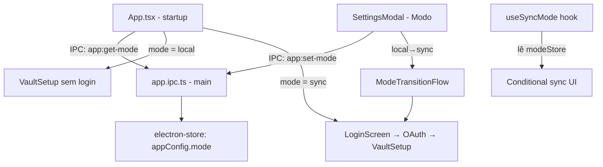

# Local or Sync Mode Design

**Spec**: `.specs/features/local-or-sync/spec.md`
**Status**: Draft

---

## Architecture Overview

O modo é uma configuração de nível de app (não de vault). Fica no `electron-store` como `appConfig.mode`. O renderer lê esse valor no startup e controla a exibição condicional de toda a UI de sync.



---

## Components

### `OnboardingModeStep.tsx`
- **Purpose**: Passo 1 do onboarding — escolha do modo
- **Location**: `src/components/onboarding/OnboardingModeStep.tsx`
- **Interfaces**:
  - Dois cards clicáveis: "Local" e "Sync com GitHub"
  - Descrição breve em cada card
  - Seleção destaca o card e habilita botão "Continuar"
  - Ao confirmar: chama `appService.setMode(mode)`
- **Dependencies**: `appService`

### `ModeTransitionFlow.tsx`
- **Purpose**: Fluxo guiado ao trocar de local→sync nas settings
- **Location**: `src/components/settings/ModeTransitionFlow.tsx`
- **Interfaces**:
  - Step 1: confirmação ("Você precisará conectar sua conta GitHub")
  - Step 2: `<LoginScreen>` inline (se não autenticado)
  - Step 3: `<SyncConfigModal>` inline (configurar repositório)
  - Ao completar: fecha modal, atualiza modo no store
- **Dependencies**: `authService`, `syncService`, `appService`

### `ModeSettingsSection.tsx`
- **Purpose**: Seção "Modo" dentro do `<SettingsModal>`
- **Location**: `src/components/settings/ModeSettingsSection.tsx`
- **Interfaces**:
  - Exibe modo atual com ícone descritivo
  - Botão "Trocar para Sync" ou "Trocar para Local"
  - Abre modal de confirmação antes de mudar
- **Dependencies**: `modeStore`, `appService`

### `useSyncMode()` hook
- **Purpose**: Permite que qualquer componente saiba o modo atual
- **Location**: `src/hooks/useSyncMode.ts`
- **Interfaces**:
  ```typescript
  function useSyncMode(): {
    mode: 'local' | 'sync'
    isSync: boolean
    isLocal: boolean
  }
  ```
- **Dependencies**: `modeStore`

### `appService` (renderer)
- **Purpose**: IPC wrapper para configurações de nível app (modo, etc.)
- **Location**: `src/services/app.ts`
- **Interfaces**:
  ```typescript
  getMode(): Promise<'local' | 'sync' | null>
  setMode(mode: 'local' | 'sync'): Promise<void>
  ```
- **Dependencies**: `window.electronAPI.app`, `modeStore`

### `app.ipc.ts` (main process)
- **Purpose**: Handlers para configurações de app
- **Location**: `electron/ipc/app.ipc.ts`
- **Interfaces**:
  ```typescript
  // app:get-mode → store.get('appConfig.mode') → 'local' | 'sync' | null
  // app:set-mode(mode) → store.set('appConfig.mode', mode)
  ```

### `modeStore`
- **Purpose**: Estado do modo no renderer
- **Location**: `src/stores/mode.store.ts`
- **Interfaces**:
  ```typescript
  interface ModeStore {
    mode: 'local' | 'sync' | null
    isLoaded: boolean
    setMode(m: 'local' | 'sync'): void
  }
  ```

---

## electron-store Schema Addition

```typescript
interface AppConfig {
  mode: 'local' | 'sync' | null   // null = onboarding não completado
  vaultPath: string | null
  theme: 'auto' | 'light' | 'dark'
  // ... outros campos existentes ...
}
```

---

## App Startup Flow

```
App abre
  ↓
app.ipc: app:get-mode
  ├─ null → exibir OnboardingModeStep
  │          ├─ local → exibir VaultSetup (sem auth)
  │          └─ sync  → exibir LoginScreen → OAuth → VaultSetup
  │
  ├─ 'local' → verificar vaultPath
  │             ├─ válido → abrir app (sem sync UI)
  │             └─ inválido → exibir VaultSetup
  │
  └─ 'sync' → verificar token (auth:check-auth)
              ├─ token presente → verificar vaultPath → abrir app
              └─ sem token → exibir LoginScreen
```

---

## Conditional Rendering Strategy

O `useSyncMode()` hook é usado nos componentes que devem aparecer/sumir com base no modo:

```tsx
// MainLayout.tsx
const { isSync } = useSyncMode()

return (
  <>
    <Sidebar />
    <Editor />
    {isSync && <SyncStatusBar />}     {/* apenas em modo sync */}
    {isSync && <SyncPanel />}
  </>
)

// SettingsModal.tsx
{isSync && <SyncSection />}
```

---

## Transition: local → sync

1. Usuário clica "Trocar para Sync" nas settings
2. Modal de confirmação com descrição das consequências
3. Se não autenticado: exibe LoginScreen inline → OAuth
4. Após auth: exibe SyncConfigModal → configura repo
5. `appService.setMode('sync')` → `modeStore.setMode('sync')` → UI atualiza
6. Sync automático inicia (se intervalo > 0)

## Transition: sync → local

1. Usuário clica "Trocar para Local" nas settings
2. Confirmação: "O sync será desativado. Notas ficam no dispositivo."
3. `syncService.stopAutoSync()` — cancela timer imediatamente
4. `appService.setMode('local')` → `modeStore.setMode('local')` → UI de sync some
5. Token OAuth permanece no keychain (pode re-ativar sync depois)

---

## Tech Decisions

| Decisão | Escolha | Motivo |
|---|---|---|
| Onde guardar modo | `electron-store: appConfig.mode` | Configuração de app, não de vault — independente do hai.json |
| Transição sync→local | Não apaga token | Usuário pode mudar de ideia; re-ativar sync sem novo login |
| Conditional sync UI | Hook `useSyncMode()` | Componentes se auto-ocultam sem prop drilling |
| Onboarding | Passo extra na entrada | Evita assumir que o usuário quer sync — opt-in explícito |
