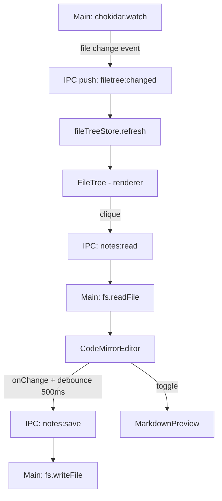

# Note Editor Design

**Spec**: `.specs/features/note-editor/spec.md`
**Status**: Draft

---

## Architecture Overview

O editor roda no renderer (React + CodeMirror 6). Leitura/escrita de arquivos e file watching ficam no main process, acessíveis via IPC. Autosave via debounce 500ms no renderer.



---

## Components

### `MainLayout.tsx`
- **Purpose**: Layout principal — sidebar + área de editor
- **Location**: `src/components/layout/MainLayout.tsx`
- **Interfaces**:
  - Renderiza `<FileTree>` (esquerda) + `<EditorPane>` (direita)
  - Sidebar colapsável via estado local
- **Dependencies**: `vaultStore`, `fileTreeStore`

### `FileTree.tsx`
- **Purpose**: Sidebar com árvore de arquivos `.md` do vault
- **Location**: `src/components/layout/FileTree.tsx`
- **Interfaces**:
  - Renderiza `FileNode[]` do `fileTreeStore`
  - Clique → `editorStore.openNote(path)`
  - Context menu: Deletar, Renomear
  - Botão "Nova nota" no topo
- **Dependencies**: `fileTreeStore`, `editorStore`

### `EditorPane.tsx`
- **Purpose**: Container do editor: toolbar + editor/preview + status bar
- **Location**: `src/components/editor/EditorPane.tsx`
- **Interfaces**:
  - Lê `editorStore.activeNote`, `editorStore.previewMode`
  - Renderiza `<CodeMirrorEditor>` ou split com `<MarkdownPreview>`
  - StatusBar: "Salvo" / "Salvando..." / "Erro ao salvar"
- **Dependencies**: `editorStore`

### `CodeMirrorEditor.tsx`
- **Purpose**: Wrapper React do CodeMirror 6
- **Location**: `src/components/editor/CodeMirrorEditor.tsx`
- **Interfaces**:
  - `initialContent: string`
  - `onChange(content: string): void`
  - Extensões: markdown lang, syntax highlighting, line wrapping, dark theme
- **Dependencies**: `@codemirror/view`, `@codemirror/lang-markdown`, `@codemirror/commands`

### `MarkdownPreview.tsx`
- **Purpose**: Renderiza markdown para HTML
- **Location**: `src/components/editor/MarkdownPreview.tsx`
- **Interfaces**:
  - `content: string` — atualiza em tempo real no modo split
- **Dependencies**: `react-markdown`, `remark-gfm`

### `notesService` (renderer)
- **Purpose**: Camada IPC para operações de notas
- **Location**: `src/services/notes.ts`
- **Interfaces**:
  ```typescript
  read(path: string): Promise<string>
  save(path: string, content: string): Promise<void>
  create(vaultPath: string, name?: string): Promise<string>
  delete(path: string): Promise<void>
  rename(oldPath: string, newName: string): Promise<string>
  listAll(vaultPath: string): Promise<FileNode[]>
  ```
- **Dependencies**: `window.electronAPI.notes`

### `notes.ipc.ts` (main process)
- **Purpose**: Handlers de filesystem para notas + setup do file watcher
- **Location**: `electron/ipc/notes.ipc.ts`
- **Interfaces**:
  ```typescript
  // notes:read (path) → string
  // notes:save (path, content) → void
  // notes:create (vaultPath, name?) → string (novo path)
  // notes:delete (path) → void  (move para lixeira via shell.trashItem)
  // notes:rename (oldPath, newName) → string
  // notes:list-all (vaultPath) → FileNode[]
  // notes:watch-start (vaultPath) → inicia chokidar, emite filetree:changed
  // notes:watch-stop () → para chokidar
  ```
- **Dependencies**: `fs/promises`, `electron.shell`, `chokidar`, `path`

### `editorStore`
- **Purpose**: Estado do editor ativo
- **Location**: `src/stores/editor.store.ts`
- **Interfaces**:
  ```typescript
  interface EditorStore {
    activeNote: { path: string; content: string } | null
    isDirty: boolean
    isSaving: boolean
    saveError: string | null
    previewMode: 'none' | 'split' | 'preview'
    openNote(path: string): Promise<void>
    setContent(content: string): void   // marca isDirty, dispara autosave
    save(): Promise<void>
    setPreviewMode(mode: PreviewMode): void
  }
  ```

### `fileTreeStore`
- **Purpose**: Estado da árvore de arquivos
- **Location**: `src/stores/fileTree.store.ts`
- **Interfaces**:
  ```typescript
  interface FileTreeStore {
    nodes: FileNode[]
    isLoading: boolean
    init(vaultPath: string): Promise<void>   // list + inicia watcher
    refresh(): Promise<void>
  }
  ```

---

## Data Models

```typescript
interface FileNode {
  name: string
  path: string
  type: 'file' | 'dir'
  children?: FileNode[]
}
```

---

## Autosave Flow

```
CodeMirrorEditor.onChange(content)
  → editorStore.setContent(content)     // isDirty = true
  → debounce(500ms) cancela anterior
  → editorStore.save()
      → notesService.save(path, content) // IPC → main → fs.writeFile
      → isDirty = false, isSaving = false
      → StatusBar: "Salvo" por 2s
```

---

## File Watcher Flow

```
notes.ipc.ts: chokidar.watch(vaultPath)
  → on('add' | 'unlink' | 'change')
  → mainWindow.webContents.send('filetree:changed')
  → renderer: window.electronAPI.onFileTreeChanged(callback)
  → fileTreeStore.refresh()
  → FileTree re-renderiza
```

---

## IPC adicionado ao Preload

```typescript
notes: {
  read: (path) => ipcRenderer.invoke('notes:read', path),
  save: (path, content) => ipcRenderer.invoke('notes:save', path, content),
  create: (vaultPath, name?) => ipcRenderer.invoke('notes:create', vaultPath, name),
  delete: (path) => ipcRenderer.invoke('notes:delete', path),
  rename: (oldPath, newName) => ipcRenderer.invoke('notes:rename', oldPath, newName),
  listAll: (vaultPath) => ipcRenderer.invoke('notes:list-all', vaultPath),
},
onFileTreeChanged: (cb) => ipcRenderer.on('filetree:changed', cb),
```

---

## Error Handling Strategy

| Error Scenario | Handling | User Impact |
|---|---|---|
| Falha ao ler arquivo | IPC retorna erro | Toast + nota abre com mensagem de erro |
| Falha ao salvar | Retry 1x, depois `saveError` no store | StatusBar: "Erro ao salvar" persistente |
| Arquivo modificado externamente | chokidar detecta, reload automático | Toast: "Arquivo atualizado externamente" |
| Vault inacessível | fs.writeFile rejeita | Toast persistente, conteúdo preservado em memória |
| Delete falha (permissão) | `shell.trashItem` rejeita | Toast de erro específico |

---

## Tech Decisions

| Decision | Choice | Rationale |
|---|---|---|
| Editor | CodeMirror 6 | Leve, mobile-ready — ver STATE.md |
| Markdown preview | `react-markdown` + `remark-gfm` | Bem mantido, GFM support, CSS customizável |
| File watching | `chokidar` no main process | Mais confiável que `fs.watch` nativo no macOS e Windows |
| Delete | `electron.shell.trashItem` | Move para lixeira — não perde dados permanentemente |
| Autosave debounce | 500ms | Balance entre responsividade e writes excessivos |
