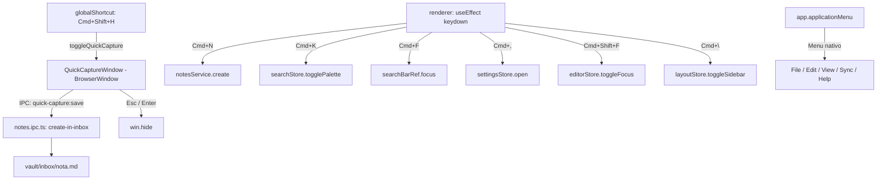

# Shortcuts Design

**Spec**: `.specs/features/shortcuts/spec.md`
**Status**: Draft

---

## Architecture Overview

A feature tem três partes distintas:

1. **Quick Capture** — segunda `BrowserWindow` leve + `globalShortcut` registrado no main process
2. **Atalhos locais** — `keymap` do CodeMirror + listeners globais no renderer (fora do editor)
3. **Menu nativo macOS** — `Menu.buildFromTemplate` no main process



---

## Quick Capture: Segunda BrowserWindow

A quick capture usa uma **janela separada** (não um overlay React) para funcionar mesmo quando o app principal está minimizado ou em segundo plano.

### Criação da janela

```typescript
// electron/windows/quickCapture.ts
import { BrowserWindow, screen } from 'electron'

let quickCaptureWin: BrowserWindow | null = null

export function createQuickCaptureWindow(mainWin: BrowserWindow): BrowserWindow {
  const { workAreaSize } = screen.getPrimaryDisplay()

  const win = new BrowserWindow({
    width: 520,
    height: 180,
    x: Math.round((workAreaSize.width - 520) / 2),
    y: Math.round(workAreaSize.height * 0.35),   // ~35% do topo
    frame: false,
    transparent: true,
    resizable: false,
    alwaysOnTop: true,
    skipTaskbar: true,
    show: false,
    webPreferences: {
      preload: join(__dirname, '../preload/index.mjs'),
      contextIsolation: true,
      nodeIntegration: false,
    },
  })

  // Carrega a mesma app React mas com rota /quick-capture
  if (process.env.NODE_ENV === 'development') {
    win.loadURL('http://localhost:5173/#/quick-capture')
  } else {
    win.loadFile(join(__dirname, '../renderer/index.html'), { hash: 'quick-capture' })
  }

  // Fechar ao perder foco (comportamento Spotlight)
  win.on('blur', () => win.hide())

  return win
}

export function toggleQuickCapture(win: BrowserWindow) {
  if (win.isVisible()) {
    win.hide()
  } else {
    win.show()
    win.focus()
    win.webContents.send('quick-capture:focus')  // focar o input
  }
}
```

### Global shortcut

```typescript
// electron/main.ts
import { globalShortcut } from 'electron'
import { createQuickCaptureWindow, toggleQuickCapture } from './windows/quickCapture'

app.whenReady().then(() => {
  // ...criar mainWindow...
  const qcWin = createQuickCaptureWindow(mainWindow)

  globalShortcut.register('CommandOrControl+Shift+H', () => {
    toggleQuickCapture(qcWin)
  })
})

app.on('will-quit', () => {
  globalShortcut.unregisterAll()
})
```

---

## Quick Capture: Componente React

A janela carrega a mesma app React com rota `#/quick-capture`. O router detecta essa rota e renderiza apenas `<QuickCaptureScreen>` — sem sidebar, sem editor.

```typescript
// src/screens/QuickCaptureScreen.tsx
```

### Visual

```
┌─────────────────────────────────────┐
│  ✏️  Capturar ideia...               │
│  ┌───────────────────────────────┐   │
│  │                               │   │
│  └───────────────────────────────┘   │
│  [Salvar  Enter]        [Esc fechar] │
└─────────────────────────────────────┘
```

- Fundo: `var(--bg-surface)` com `border-radius: 12px` e `box-shadow` pesada
- `transparent: true` na janela + `background: transparent` no `#root` para bordas arredondadas visíveis no macOS
- Input `textarea` (permite multi-linha) com foco automático
- Placeholder: "Capturar ideia..."

### IPC de save

```typescript
// quick-capture:save(content)
//   → deriva título: primeiros 50 chars da primeira linha ou timestamp
//   → notes:create-in-inbox(vaultPath, content, title)
//   → win.hide()
//   → emite 'filetree:changed' para atualizar sidebar na janela principal
```

---

## Atalhos Locais: Estratégia

Atalhos fora do editor: listener global no renderer com `useEffect` no `MainLayout` ou `App`.

```typescript
// src/hooks/useGlobalShortcuts.ts
export function useGlobalShortcuts() {
  useEffect(() => {
    const handler = (e: KeyboardEvent) => {
      const meta = e.metaKey || e.ctrlKey

      if (meta && e.key === 'n') { e.preventDefault(); notesService.create(vaultPath) }
      if (meta && e.key === 'k') { e.preventDefault(); searchStore.togglePalette() }
      if (meta && e.key === 'f') { e.preventDefault(); searchBarRef.current?.focus() }
      if (meta && e.key === ',') { e.preventDefault(); settingsStore.setOpen(true) }
      if (meta && e.shiftKey && e.key === 'F') { e.preventDefault(); editorStore.toggleFocusMode() }
      if (meta && e.key === '\\') { e.preventDefault(); layoutStore.toggleSidebar() }
      if (meta && e.key === 's') { e.preventDefault(); editorStore.save() }
      if (meta && e.shiftKey && e.key === 'S') { e.preventDefault(); syncService.push() }
      if (meta && e.key === 'h') { e.preventDefault(); syncStore.toggleHistory() }
      if (meta && e.key === 'w') { e.preventDefault(); editorStore.closeNote() }
    }

    window.addEventListener('keydown', handler)
    return () => window.removeEventListener('keydown', handler)
  }, [])
}
```

**Atalhos dentro do CodeMirror** (Cmd+S manual) — adicionados ao `keymap` do editor para não serem interceptados pelo textarea:

```typescript
keymap.of([
  { key: 'Mod-s', run: () => { editorStore.save(); return true } },
])
```

---

## Menu Nativo macOS (SHORT-03)

```typescript
// electron/menu.ts
import { Menu, shell } from 'electron'

export function buildAppMenu(mainWindow: BrowserWindow) {
  const template = [
    { role: 'appMenu' },
    {
      label: 'Arquivo',
      submenu: [
        { label: 'Nova Nota',      accelerator: 'CmdOrCtrl+N',       click: () => mainWindow.webContents.send('menu:new-note') },
        { label: 'Captura Rápida', accelerator: 'CmdOrCtrl+Shift+H', click: () => toggleQuickCapture(qcWin) },
        { type: 'separator' },
        { label: 'Importar...',    click: () => mainWindow.webContents.send('menu:import') },
        { label: 'Exportar PDF',   accelerator: 'CmdOrCtrl+Shift+E', click: () => mainWindow.webContents.send('menu:export-pdf') },
      ],
    },
    {
      label: 'Editar',
      submenu: [
        { role: 'undo' }, { role: 'redo' }, { type: 'separator' },
        { role: 'cut' }, { role: 'copy' }, { role: 'paste' },
        { type: 'separator' },
        { label: 'Buscar',          accelerator: 'CmdOrCtrl+F',       click: () => mainWindow.webContents.send('menu:search') },
        { label: 'Command Palette', accelerator: 'CmdOrCtrl+K',       click: () => mainWindow.webContents.send('menu:palette') },
      ],
    },
    {
      label: 'Visualizar',
      submenu: [
        { label: 'Modo Foco',       accelerator: 'CmdOrCtrl+Shift+F', click: () => mainWindow.webContents.send('menu:focus-mode') },
        { label: 'Toggle Sidebar',  accelerator: 'CmdOrCtrl+\\',      click: () => mainWindow.webContents.send('menu:toggle-sidebar') },
        { label: 'Histórico',       accelerator: 'CmdOrCtrl+H',       click: () => mainWindow.webContents.send('menu:history') },
      ],
    },
    {
      label: 'Sync',
      submenu: [
        { label: 'Sincronizar',     accelerator: 'CmdOrCtrl+Shift+S', click: () => mainWindow.webContents.send('menu:sync') },
      ],
    },
  ]

  Menu.setApplicationMenu(Menu.buildFromTemplate(template as any))
}
```

O renderer escuta eventos `menu:*` via `ipcRenderer.on` e executa as ações correspondentes.

---

## Components

### `QuickCaptureScreen.tsx`
- **Purpose**: Tela única da janela flutuante de quick capture
- **Location**: `src/screens/QuickCaptureScreen.tsx`
- **Interfaces**:
  - `textarea` com foco automático ao receber `quick-capture:focus`
  - Enter (sem Shift): salva e fecha
  - Shift+Enter: quebra de linha (multi-linha)
  - Esc: fecha sem salvar
  - Contador de caracteres (opcional, máx 2000)
- **Dependencies**: `window.electronAPI.quickCapture.save()`

### `useGlobalShortcuts` hook
- **Purpose**: Registrar todos os atalhos locais fora do editor
- **Location**: `src/hooks/useGlobalShortcuts.ts`
- **Interfaces**: Hook sem parâmetros, montado no `MainLayout`

---

## Data Models / IPC additions

```typescript
// Preload — novos namespaces

quickCapture: {
  save: (content: string) => ipcRenderer.invoke('quick-capture:save', content),
  onFocus: (cb) => ipcRenderer.on('quick-capture:focus', cb),
}

menu: {
  onAction: (action: string, cb: () => void) => ipcRenderer.on(`menu:${action}`, cb),
}
```

---

## Tech Decisions

| Decisão | Escolha | Motivo |
|---|---|---|
| Quick capture | Segunda BrowserWindow | Funciona fora do foco do app; overlay React não tem acesso global |
| Rota `/quick-capture` | Hash router na mesma app React | Reutiliza build existente; sem segundo entry point no Vite |
| `transparent: true` + `frame: false` | Bordas arredondadas nativas no macOS | Melhor visual sem hacks CSS |
| `win.on('blur', hide)` | Fechar ao perder foco | Comportamento Spotlight — menos intrusivo que botão fechar |
| Atalhos locais | `useEffect` + `keydown` global no renderer | Simples, sem lib extra; funciona em todo o renderer |
| Atalhos no editor | `keymap.of()` do CodeMirror | Previne que o CodeMirror consuma o evento antes |
| Menu nativo | `Menu.buildFromTemplate` + `ipcRenderer.on('menu:*')` | Padrão Electron para menus; atalhos visíveis no menu nativo do macOS |
