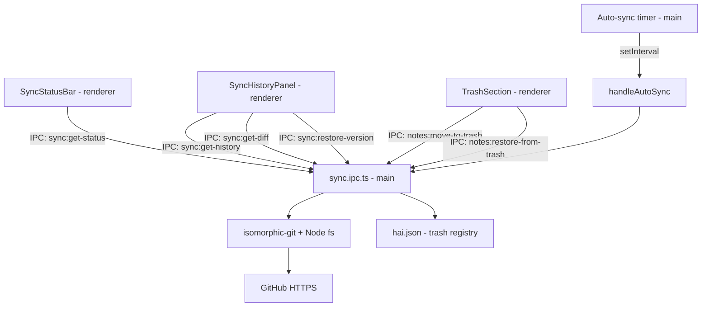

# Sync v2 Design

**Spec**: `.specs/features/sync-v2/spec.md`
**Status**: Draft

---

## Architecture Overview

Sync v2 estende o sync manual (github-sync) com: auto-sync em background via `setInterval` no main process, painel de histórico de commits com diff visual, e lixeira gerenciada pelo hai.json.



---

## Components

### `SyncStatusBar.tsx`
- **Purpose**: Item na bottom statusbar com estado de sync (estilo VSCode)
- **Location**: `src/components/sync/SyncStatusBar.tsx`
- **Interfaces**:
  - Ícone + texto: `⟳ Sincronizando` | `✓ Sincronizado` | `○ N pendentes` | `✕ Erro`
  - Tooltip: timestamp do último sync
  - Click → abre `<SyncPanel>` (já existente de github-sync)
- **Dependencies**: `syncStore`

### `SyncHistoryPanel.tsx`
- **Purpose**: Painel lateral com timeline de commits
- **Location**: `src/components/sync/SyncHistoryPanel.tsx`
- **Interfaces**:
  - Abre via Cmd+H ou clique no statusbar
  - Lista commits: hash curto, mensagem, data relativa, número de arquivos
  - Click em commit → carrega `<CommitDiffViewer>` para nota ativa
  - Botão "Restaurar esta versão" por commit
- **Dependencies**: `syncStore`, `syncService`

### `CommitDiffViewer.tsx`
- **Purpose**: Diff visual de uma nota entre commit selecionado e HEAD
- **Location**: `src/components/sync/CommitDiffViewer.tsx`
- **Interfaces**:
  - Recebe `{ commitHash, notePath, currentContent, commitContent }`
  - Diff linha a linha: linhas adicionadas (verde), removidas (vermelho), contexto (cinza)
  - Sem dependência externa — diff calculado via `diff-match-patch` ou algoritmo simples
- **Dependencies**: —

### `TrashSection.tsx`
- **Purpose**: Seção "Lixeira" colapsada na sidebar
- **Location**: `src/components/sidebar/TrashSection.tsx`
- **Interfaces**:
  - Lista notas deletadas com data de deleção
  - Botão "Restaurar" por nota
  - Botão "Esvaziar lixeira" no header da seção
  - Badge com contagem de itens
- **Dependencies**: `manifestStore`, `manifestService`

### `syncService` (adições)
- **Purpose**: Novos métodos para histórico e auto-sync
- **Location**: `src/services/sync.ts` (extensão do existente)
- **Interfaces adicionadas**:
  ```typescript
  getHistory(limit?: number): Promise<CommitEntry[]>
  getDiff(commitHash: string, notePath: string): Promise<DiffResult>
  restoreVersion(commitHash: string, notePath: string): Promise<void>
  setAutoSync(intervalMinutes: number): Promise<void>
  stopAutoSync(): Promise<void>
  ```

### `manifest.ipc.ts` (adições para lixeira)
- **Purpose**: Operações de lixeira integradas ao hai.json
- **Interfaces adicionadas**:
  ```typescript
  // notes:move-to-trash(path)
  //   → move arquivo para .trash/<nome>.md
  //   → registra em hai.json.trash[]: { path, deletedAt, originalPath }

  // notes:restore-from-trash(path)
  //   → move de .trash/ para originalPath
  //   → remove do hai.json.trash[]

  // notes:empty-trash()
  //   → deleta todos arquivos em .trash/
  //   → limpa hai.json.trash[]

  // notes:auto-purge-trash()
  //   → remove entradas com deletedAt > retentionDays
  ```

---

## Data Models

```typescript
interface CommitEntry {
  hash: string
  shortHash: string
  message: string
  timestamp: string       // ISO date
  filesChanged: string[]
}

interface DiffResult {
  notePath: string
  commitHash: string
  lines: DiffLine[]
}

interface DiffLine {
  type: 'add' | 'remove' | 'context'
  content: string
  lineNumber: number
}

// Adição ao HaiManifest (data-model)
interface TrashEntry {
  path: string            // caminho em .trash/
  originalPath: string    // onde estava antes
  deletedAt: string       // ISO date
}
// HaiManifest.trash: TrashEntry[]
```

---

## Auto-Sync Flow

```typescript
// electron/ipc/sync.ipc.ts — adição

let autoSyncTimer: NodeJS.Timeout | null = null

ipcMain.handle('sync:set-auto', async (_, intervalMinutes: number) => {
  if (autoSyncTimer) clearInterval(autoSyncTimer)
  if (intervalMinutes === 0) return  // manual

  autoSyncTimer = setInterval(async () => {
    const status = await getStatus(vaultPath)
    if (status.pendingChanges > 0) {
      await handlePush(vaultPath)
    }
    // pull com fast-forward only — se conflito, apenas notifica
    await handleSafePull(vaultPath, mainWindow)
  }, intervalMinutes * 60_000)
})

async function handleSafePull(vaultPath: string, win: BrowserWindow) {
  const result = await handlePull(vaultPath)
  if (result.hasConflicts) {
    win.webContents.send('sync:conflict-detected', result.conflicts)
    // não auto-resolve — aguarda ação do usuário
  }
}
```

---

## Histórico: isomorphic-git Log

```typescript
// sync.ipc.ts — handler 'sync:get-history'
async function handleGetHistory(vaultPath: string, limit = 50): Promise<CommitEntry[]> {
  const commits = await git.log({ fs, dir: vaultPath, depth: limit })
  return commits.map(c => ({
    hash: c.oid,
    shortHash: c.oid.slice(0, 7),
    message: c.commit.message.trim(),
    timestamp: new Date(c.commit.author.timestamp * 1000).toISOString(),
    filesChanged: [],  // populado sob demanda no get-diff
  }))
}

// sync.ipc.ts — handler 'sync:get-diff'
async function handleGetDiff(vaultPath: string, commitHash: string, notePath: string) {
  const commitContent = await git.readBlob({
    fs, dir: vaultPath, oid: commitHash, filepath: notePath
  })
  const currentContent = await fs.readFile(path.join(vaultPath, notePath), 'utf-8')
  return computeLineDiff(currentContent, new TextDecoder().decode(commitContent.blob))
}
```

---

## IPC adicionado ao Preload

```typescript
// Adições ao namespace sync existente
sync: {
  // ... existentes ...
  getHistory: (limit?) => ipcRenderer.invoke('sync:get-history', limit),
  getDiff: (hash, path) => ipcRenderer.invoke('sync:get-diff', hash, path),
  restoreVersion: (hash, path) => ipcRenderer.invoke('sync:restore-version', hash, path),
  setAutoSync: (interval) => ipcRenderer.invoke('sync:set-auto', interval),
  stopAutoSync: () => ipcRenderer.invoke('sync:stop-auto'),
  onConflictDetected: (cb) => ipcRenderer.on('sync:conflict-detected', cb),
},
// Adições ao namespace notes
notes: {
  // ... existentes ...
  moveToTrash: (path) => ipcRenderer.invoke('notes:move-to-trash', path),
  restoreFromTrash: (path) => ipcRenderer.invoke('notes:restore-from-trash', path),
  emptyTrash: () => ipcRenderer.invoke('notes:empty-trash'),
}
```

---

## Diff Rendering

Sem biblioteca externa — algoritmo simples de diff linha a linha:

```typescript
function computeLineDiff(current: string, old: string): DiffLine[] {
  const currentLines = current.split('\n')
  const oldLines = old.split('\n')
  // LCS simples para N < 500 linhas — suficiente para notas de texto
  // Para notas maiores: usar diff-match-patch (instalar se necessário)
}
```

---

## Tech Decisions

| Decisão | Escolha | Motivo |
|---|---|---|
| Auto-sync timer | `setInterval` no main process | Roda mesmo com renderer minimizado; cancelável via IPC |
| Histórico | `isomorphic-git log` + `readBlob` | Zero deps extras; já disponível |
| Diff | Algoritmo LCS simples / diff-match-patch | Notas são texto curto; não precisa de diff pesado |
| Lixeira | `.trash/` no vault + hai.json | Lixeira versionada junto com notas; portável |
| Auto-purge | Job diário no app startup | Simples, sem cron externo |
| Restaurar versão | Sobrescrever arquivo + git add no próximo push | Sem operações git complexas (cherry-pick, etc.) |
