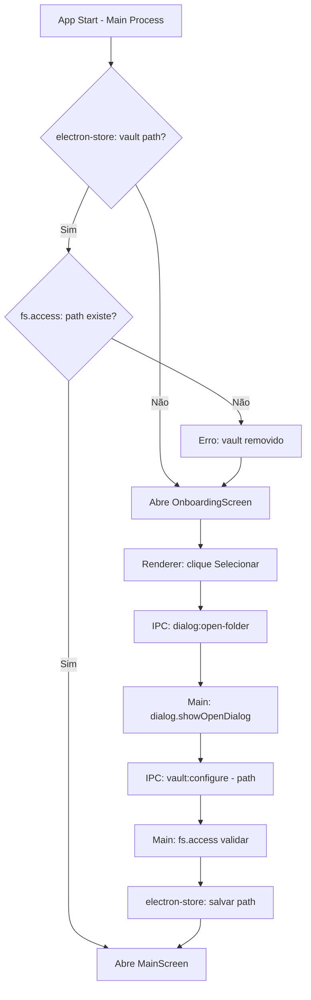

# Vault Setup Design

**Spec**: `.specs/features/vault-setup/spec.md`
**Status**: Draft

---

## Architecture Overview

Vault Setup configura a pasta raiz do app. A UI (renderer) se comunica com o main process via IPC para operações de filesystem e dialog nativo. Configuração persiste via `electron-store`.



---

## Project Structure

```
muta/
├── electron/
│   ├── main.ts               # Entry point do main process
│   ├── preload.ts            # contextBridge: expõe IPC ao renderer
│   └── ipc/
│       ├── vault.ipc.ts      # Handlers IPC de vault
│       ├── notes.ipc.ts      # Handlers IPC de notas (Note Editor)
│       └── sync.ipc.ts       # Handlers IPC de sync (GitHub Sync)
├── src/                      # React app (renderer)
│   ├── components/
│   │   ├── layout/
│   │   │   ├── AppShell.tsx
│   │   │   └── MainLayout.tsx
│   │   └── vault/
│   │       └── OnboardingScreen.tsx
│   ├── services/
│   │   └── vault.ts          # Chama IPC via window.electronAPI
│   ├── stores/
│   │   └── vault.store.ts    # Zustand
│   └── main.tsx
├── index.html
├── vite.config.ts            # Build do renderer
├── vite.electron.config.ts   # Build do main process
└── package.json
```

---

## IPC Bridge (Preload)

O `preload.ts` expõe uma API tipada para o renderer via `contextBridge`. O renderer **nunca** acessa Node.js diretamente — tudo passa pelo preload.

```typescript
// electron/preload.ts
contextBridge.exposeInMainWorld('electronAPI', {
  vault: {
    openPicker: () => ipcRenderer.invoke('vault:open-picker'),
    configure: (path: string) => ipcRenderer.invoke('vault:configure', path),
    load: () => ipcRenderer.invoke('vault:load'),
    create: (name: string, parentPath: string) => ipcRenderer.invoke('vault:create', name, parentPath),
  },
  // ... notes, sync
})
```

---

## Components

### `AppShell.tsx`
- **Purpose**: Decide qual tela renderizar com base no vault configurado
- **Location**: `src/components/layout/AppShell.tsx`
- **Interfaces**:
  - No mount: chama `vaultService.load()` → popula `vaultStore`
  - Se `vaultStore.path === null` → `<OnboardingScreen>`
  - Senão → `<MainLayout>`
- **Dependencies**: `vaultStore`, `vaultService`

### `OnboardingScreen.tsx`
- **Purpose**: Tela de primeiro uso para configurar o vault
- **Location**: `src/components/vault/OnboardingScreen.tsx`
- **Interfaces**:
  - "Selecionar pasta" → `vaultService.openPicker()`
  - "Criar novo vault" → `vaultService.create(name, location)`
- **Dependencies**: `vaultService`, `vaultStore`

### `vaultService` (renderer)
- **Purpose**: Camada de serviço no renderer — delega tudo para IPC
- **Location**: `src/services/vault.ts`
- **Interfaces**:
  ```typescript
  openPicker(): Promise<void>
  create(name: string, parentPath: string): Promise<void>
  load(): Promise<VaultConfig | null>
  ```
- **Dependencies**: `window.electronAPI.vault`

### `vault.ipc.ts` (main process)
- **Purpose**: Handlers IPC — lógica real de filesystem e dialog
- **Location**: `electron/ipc/vault.ipc.ts`
- **Interfaces**:
  ```typescript
  // vault:open-picker
  // Abre dialog nativo, valida path, salva no electron-store
  // vault:configure (path: string)
  // Valida permissões com fs.access, salva config
  // vault:load
  // Lê electron-store, verifica se path ainda existe
  // vault:create (name, parentPath)
  // fs.mkdir, depois configura como vault
  ```
- **Dependencies**: `electron.dialog`, `fs/promises`, `electron-store`

### `vault.store.ts`
- **Purpose**: Estado global do vault no renderer
- **Location**: `src/stores/vault.store.ts`
- **Interfaces**:
  ```typescript
  interface VaultStore {
    path: string | null
    name: string | null
    isLoading: boolean
    error: string | null
    setVault(config: VaultConfig): void
    clearVault(): void
  }
  ```

---

## Data Models

```typescript
interface VaultConfig {
  path: string        // caminho absoluto
  name: string        // nome da pasta (display)
  configuredAt: string
}
```

**Persistência**: `electron-store` → `~/.config/muta/config.json` (ou equivalente por SO)

---

## Error Handling Strategy

| Error Scenario | Handling | User Impact |
|---|---|---|
| Pasta sem permissão | `fs.access` com `fs.constants.R_OK \| W_OK` falha | Toast de erro, dialog reaberto |
| Vault salvo não existe | `vault:load` retorna null | Tela de erro → Onboarding |
| Path raiz do SO | Validação bloqueia `/`, `C:\` | Toast de aviso específico |
| electron-store corrompido | Try/catch, fallback para null | App trata como primeiro uso |

---

## Tech Decisions

| Decision | Choice | Rationale |
|---|---|---|
| State management | Zustand | Leve, sem boilerplate |
| Persistência de config | `electron-store` | API simples, JSON tipado, cross-platform |
| Dialog nativo | `electron.dialog` no main process | Único lugar correto em Electron para dialogs nativos |
| Acesso FS renderer | Sempre via IPC | Segurança: renderer nunca acessa Node.js diretamente |
